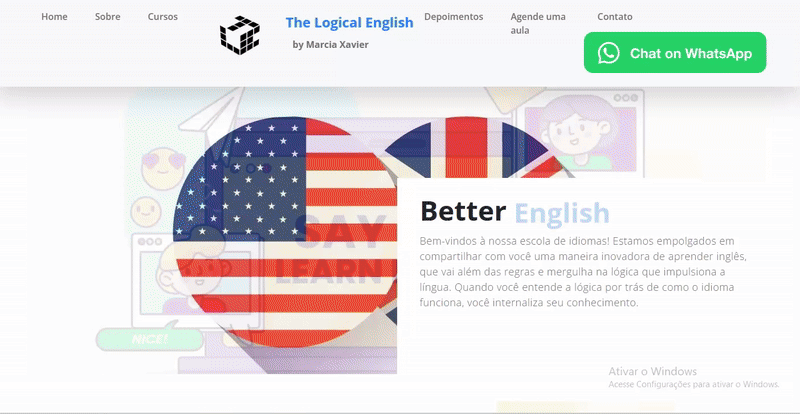

# Meu primeiro site  
  

## Descrição  
Este é o site da **The Logical English**, a escola online que eu criei há alguns anos com a intenção de facilitar o acesso dos meus alunos.  
Eu já não trabalho mais com ensino de língua inglesa, mas tive a curiosidade de aprender e fazer meu próprio site.  

## Demonstração  
  

## 🚀 Tecnologias Utilizadas  
  
  
  

## 📌 Funcionalidades  
O site está dividido em:  
- 🏠 **Home**  
- ℹ️ **Sobre**  
- 📚 **Cursos**  
- 🗣️ **Depoimentos**  
- 📅 **Agende uma aula**  
- 📩 **Contato**  

## 📥 Instalação  
Se quiser clonar este projeto, fique à vontade!  

git clone https://github.com/seu-usuario/seu-repositorio.git

## 💡 Uso
O código é bem simples de ser customizado. Basta ter conhecimento básico de código e lógica de programação.

## 🤝 Contribuições
O projeto não está aberto a contribuições, mas ficarei feliz em receber seu feedback.

## 📞 Contato

# My First Website  
  

## Description  
This is the website for **The Logical English**, the online school I created a few years ago with the intention of making it easier for my students to access resources.  
I no longer work in English language teaching, but I was curious to learn and build my own website.  

## Demo  
  

## 🚀 Technologies Used  
  
  
  

## 📌 Features  
The website is divided into:  
- 🏠 **Home**  
- ℹ️ **About**  
- 📚 **Courses**  
- 🗣️ **Testimonials**  
- 📅 **Schedule a Class**  
- 📩 **Contact**  

## 📥 Installation  
If you want to clone this project, feel free to do so!  

git clone https://github.com/your-username/your-repository.git

## 💡 Usage
The code is very simple to customize. Basic coding knowledge and programming logic are all you need.

## 🤝 Contributions
The project is not open to contributions, but I’d be happy to receive your feedback.

## 📞 Contact

